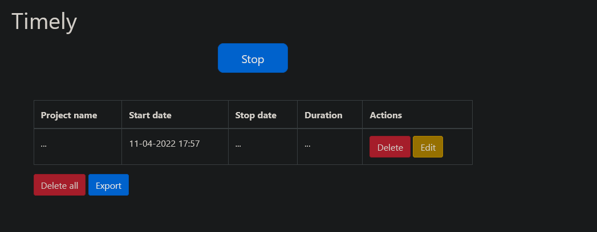
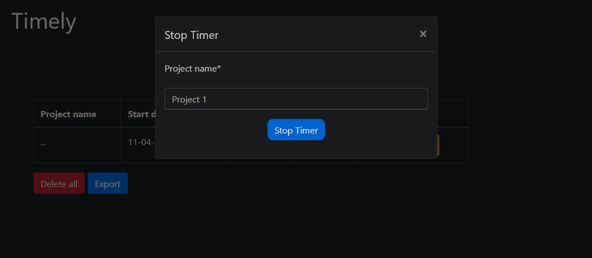
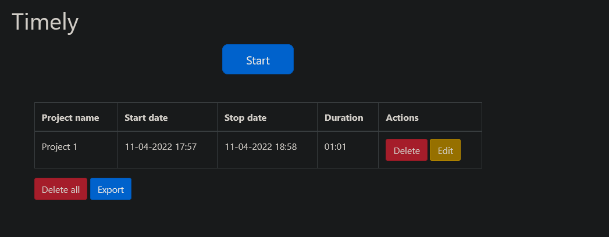

# Timely

## Table of Contents
* [Introduction](#introduction)
* [Technologies](#technologies)
* [Features](#features)
* [Project structure](#project-structure)
* [Endpoints](#endpoints)

## Introduction
---
Timely is a time tracking software used by developers to track how much time they spent on
each project they’re working on. Timely can be used for multiple projects and it allows you to
log work sessions.

Work sessions are defined as follows:
- They have a start and end date (and time)
- They have the name of the project

The application consists of only one page. Initially the page looks something like this:


#

The application consists of only one page. Initially the page looks something like this:
When user clicks on “Start” button, time tracking starts:


#

When the user is done working on the current project and clicks on the “Stop” button, then a
modal dialog is presented asking to enter the project name:


#


When “Stop timer” is clicked, user is presented with the list of completed entries:



And that’s it!


## Technologies
---
- Java
- Spring Boot 
- Javascript
- Spring Data
- Thymeleaf
- MySQL
- JPA / Hibernate
- Lombook
- Bootstrap

## Features
---
- add / edit / delete / projects
- Pagination of the projects grid
- Deleting project grid (both completed and in-progress)
- Editing completed project entries
- Exporting of the projects grid to Excel
- REST API
## Project structure
---
``` 
main
├───java
|   └───com
|       └───example
|           └───timely
|               |   TimelyApplication.java
|               |   
|               ├───controller
|               |       MainController.java
|               |       
|               ├───model
|               |   |   Project.java
|               |   |   
|               |   └───paging
|               |           Page.java
|               |           Paged.java
|               |           PageItem.java
|               |           PageItemType.java
|               |           Paging.java
|               |           
|               ├───repository
|               |       ProjectRepository.java
|               |       
|               └───service
|                       ProjectService.java
|                       
└───resources
    |   application.properties
    |   
    ├───static
    └───templates
            index.html
``` 

## Endpoints
---

| endpoint                             | description                           | method |
|--------------------------------------|---------------------------------------|--------|
| /                                    | show main page                        | GET    |
| /Start                               | add start time                        | POST   |
| /Stop                                | add stop time and project name        | POST   |
| /delete/{id}                         | delete project                        | GET    |
| /deleteAll                           | delete all projects                   | GET    |
| /edit/{id}                           | edit project                          | GET    |
| /export                              | exports projects into a .xlsx file    | GET    |